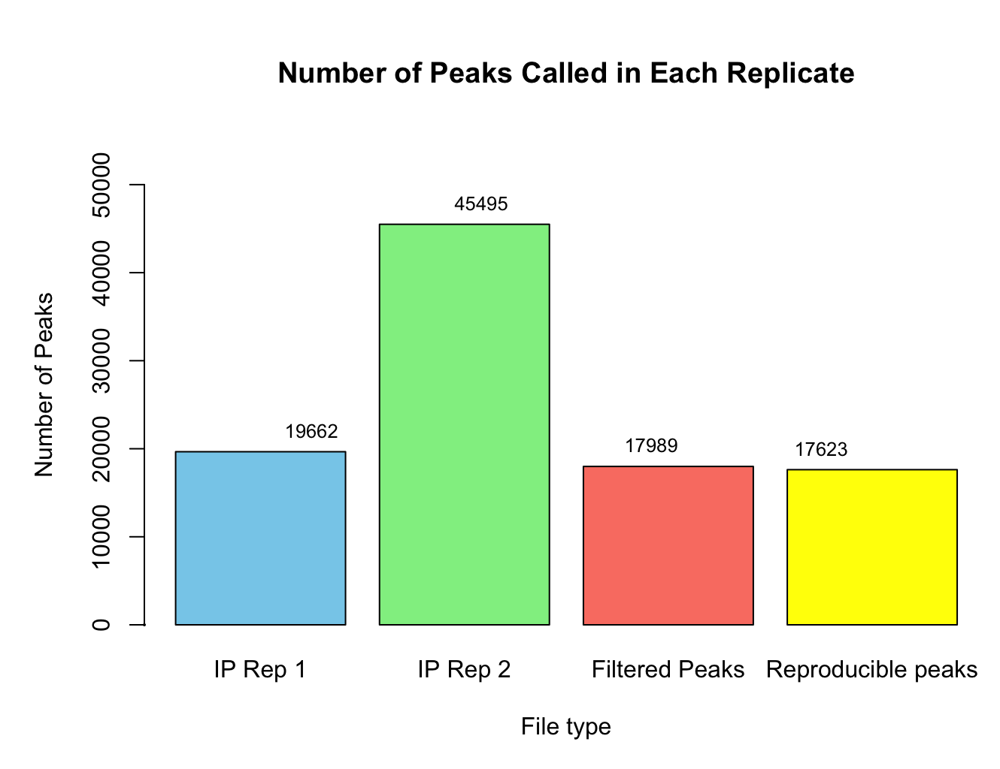

```{r setup, include=FALSE}
knitr::opts_chunk$set(echo = TRUE)
```

# ChIP-seq Project Summary 

## Quality of the sequencing reads and the alignment statistics:

Based on the QC results, IP_rep1 and IP_rep2 showcase several warning flags, particularly regarding sequence quality, GC content, and base N content. These issues could potentially affect downstream analysis and interpretation. Therefore, it might be advisable to exclude these samples from further analysis or to proceed with caution, considering potential biases introduced by the observed quality issues. 

According to MultiQC, total sequences and total bases indicate the volume of sequencing data generated for each sample, which appears to be substantial across all samples. Sequences flagged as poor quality show that none of the sequences are flagged as poor quality, suggesting that the majority of the data passes basic quality thresholds. The sequence length and GC content appear consistent across samples, with slight variations but no alarming deviations. The percentage of deduplicated sequences is relatively high across all samples, indicating that duplicate reads have been effectively identified and removed. The Samtools alignment statistics show high percentages of mapped reads for all samples, indicating successful alignment to the reference genome. 

Properly paired percentages are also high which means that most reads are correctly paired in the sequencing data. While there are some warnings and flags noted in the MultiQC results (such as warnings for per tile sequence quality and per sequence GC content), these seem consistent with the individual quality control metrics previously discussed. Overall, the MultiQC results indicate that the majority of the sequencing data passes quality thresholds and is suitable for downstream analysis. 

## Fingerprint plot and heatmap plot of correlation values between samples:

```{r, Fingerprint plot}

```

The fingerprint plot illustrates the distribution of reads across samples. The fact that all four samples start at 0 and follow an almost linear slope up to 1 suggests that the sequencing data is of high quality and uniform across samples. This indicates consistency in sequencing depth and coverage across the samples, which is essential for reliable downstream analysis.

```{r, Correlation heatmap}

```

The correlation heatmap displays the correlation values between samples. The correlation of 1 among each and every sample indicates strong positive correlations which points to high similarity/ reproducibility between the samples. This is a positive indicator and implies that the samples are biologically and technically comparable which reinforces the reliability of the experimental results.

## Peak calling analysis:

```{r, Number of peaks}

```

Number of Peaks in Each Replicate:
IP Replicate 1: 19,662 peaks
IP Replicate 2: 45,495 peaks

Number of Peaks in Reproducible Peaks: 17,623 peaks
The strategy used to determine "reproducible" peaks involved intersecting the peak calls from the two replicates. The reproducible peaks are those that overlap between the two replicates, indicating consistency in peak calling across replicates.

Number of Peaks After Filtering Out Blacklisted Regions:
After filtering out peaks overlapping blacklisted regions, the number of peaks remaining is: 17,989 peaks

These results suggest that there is a considerable overlap of peaks between the replicates. Additionally, filtering out peaks overlapping blacklisted regions helps ensure that the identified peaks are biologically relevant.

## Motif analysis and gene enrichment on the peak annotations:

```{r, Motifs}

```

The motif analysis aims to identify sequence motifs that are over-represented in the genomic regions identified as peaks. These motifs often represent binding sites for transcription factors or other regulatory proteins. In this analysis, the motifs are categorized based on their q-values, which represent the statistical significance of enrichment. The most significant motifs (q-value <= 0.001) indicate potential binding sites for regulatory factors that may be involved in the transcriptional regulation of target genes. Most of the motifs belong to this category which means that they are significant. 

```{r, GSEA}

```

Gene enrichment analysis identifies biological pathways or functions that are significantly over-represented among the genes associated with the identified peaks. The results include enriched pathways or gene sets, along with their statistical significance, enrichment scores, and leading-edge genes. According to DAVID tool's results, the samples are related to Tumor Suppressing activities. 53 genes associated with the term "Tumor suppressor" were found in the gene list. 

## Proportions of where the factor of interest is binding:

```{r, Proportions of binding}

```

The fact that most of the factor's binding occurs in promoters suggests that it may predominantly regulate gene expression by directly interacting with promoter regions. Binding to intergenic regions indicates that the factor may also have regulatory functions beyond gene promoters. Binding near the transcription start site (TSS) suggests that the factor may be involved in the initiation or regulation of transcription. Binding to regions located upstream of genes, particularly within 5kb or 10kb of the TSS, indicates potential regulatory roles in controlling gene expression from a distance.

## Coverage plots:

```{r, IP rep1 Coverage plot}

```

```{r, IP rep2 Coverage plot}

```

Peaks at the TES may indicate the presence of regulatory elements involved in transcriptional termination or processing, such as RNA processing factors. Additionally, chromatin features such as nucleosome positioning or histone modifications may also contribute to the observed peaks at TES. Overall, the presence of peaks in the coverage plots at the TES highlights potential regulatory activity or chromatin features associated with transcriptional termination. 

## References:

B.T. Sherman, M. Hao, J. Qiu, X. Jiao, M.W. Baseler, H.C. Lane, T. Imamichi and W. Chang. DAVID: a web server 
for functional enrichment analysis and functional annotation of gene lists (2021 update). Nucleic Acids 
Research. 23 March 2022. doi:10.1093/nar/gkac194.[PubMed]

Huang DW, Sherman BT, Lempicki RA. Systematic and integrative analysis of large gene lists using DAVID 
Bioinformatics Resources. Nature Protoc. 2009;4(1):44-57.  [PubMed]